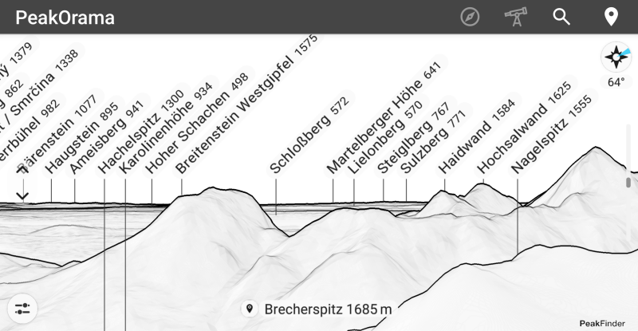

<pre>Send a coffee to 
woheller69@t-online.de 

  
Or via this link (with fees)
</pre>

# PeakOrama - show mountains around a location

 

This app shows mountains around a location using the PeakFinder-API.
Location can either be searched via the [Open-Meteo](https://open-meteo.com/) or via the GPS of your device.
The view can be rotated manually on the screen, or based on the built-in compass of your device or via direction of movement.
In case your compass has an offset even after calibration there is an option to adjust the offset.
Setting marks is not supported.

A working internet connection is required to use this app. 
Approximately 5-10 MB of data is downloaded for each location, so be mindful of your data usage.
For offline capability, consider using the official [PeakFinder app](https://www.peakfinder.com/mobile/).

# License
This work is licensed under GPLv3, © woheller69

- This app is built on the [PeakFinder-API](https://github.com/Fabiz/PeakFinder-API), published under MIT license
- It uses code from [Compass](https://github.com/Kr0oked/Compass), published under GPLv3 license
- Search-as-you-type location search is provided by [Open-Meteo](https://open-meteo.com/), under <a href='http://creativecommons.org/licenses/by/4.0/'>Attribution 4.0 International (CC BY 4.0)</a>

# OTHER APPS

| **RadarWeather** | **Gas Prices** | **Smart Eggtimer** |
|:---:|:---:|:---:|
|  |  |  |
| **Bubble** | **hEARtest** | **GPS Cockpit** |
|  |  |  |
| **Audio Analyzer** | **LavSeeker** | **TimeLapseCam** |
|  | |  |
| **Arity** | **Cirrus** | **solXpect** |
|  |  |  |
| **gptAssist** | **dumpSeeker** | **huggingAssist** |
|  |  |  |
| **FREE Browser** | **whoBIRD** | **PeakOrama** |
|  |  |  |
| **Whisper** | **Seamless** | |
|  |  | |

 